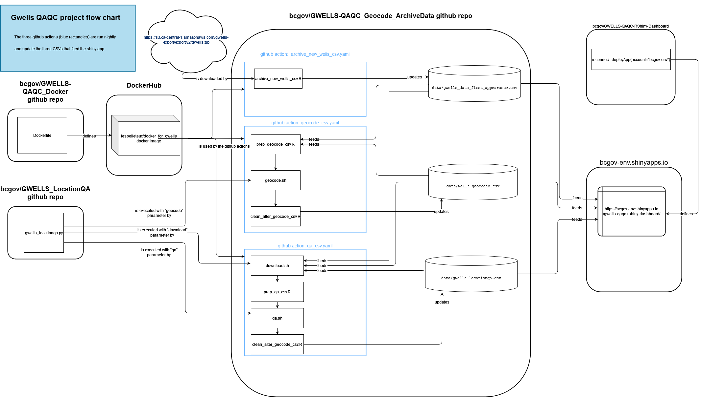

# GWELLS-QAQC-RShiny-Dashboard
An R Shiny dashboard that automates filtering and prioritizing wells within the GWELLS database to automate data QAQC

It comes in the form of a package named `gwellsshiny`.

# Process map     

The data for this shiny comes from a CSV located in the GWELLS-QAQC_Geocode_ArchiveData repository located at https://github.com/bcgov/GWELLS-QAQC_Geocode_ArchiveData.  The CSV is updated nightly by a github action defined in that repo.  Here is the whole process generating the files.



### Installing the `gwellsshiny` package  

```r
remotes::install_github("bcgov/GWELLS-QAQC-RShiny-Dashboard")
```

### Running the app on your computer  

 - Run `remotes::install_github("bcgov/GWELLS-QAQC-RShiny-Dashboard")`  
 - Clone repository ("git clone git@github.com:bcgov/GWELLS-QAQC-RShiny-Dashboard.git")  
 - Open the "gwells_shiny.Rproj" project in RStudio  
 - (make desired changes)  
 - run `devtools::load_all(".")`   (or press Ctrl-Alt-L)  
 - run `run_app()`  

### Deploying the app to shinyapps.io  

 - Run `remotes::install_github("bcgov/GWELLS-QAQC-RShiny-Dashboard")`
 - Clone repository
 - Open the "gwells_shiny.Rproj" project in RStudio
 - (make desired changes)   
 - git commit and push your changes
 - run `devtools::build()`
 - run `rsconnect::setAccountInfo(
     name='bcgov-env',  
     token='TOKEN',  
     secret='SECRET')`,  where  TOKEN and SECRET and the values found by login in to shinyapps.io with the bcgov-env user and navigating to the "Account - Tokens" in the sidebar on the left.    
    
 - run `rsconnect::deployApp(account = "bcgov-env")`  


# BC Shiny Template  

The CSS and code for the footer comes from https://github.com/bcgov/ensemble-app-CMIP5

# File naming conventions   

This project was built as a R package using the {golem} approach described in the [engineering production-grade shiny apps](https://engineering-shiny.org/structuring-project.html#conventions-matter) book.  


The rest of this section contains excepts from that book.  

Using a convention allows everyone to know where to look when debugging, refactoring, or implementing new features. For example, if you follow golem’s convention (which is the one developed in this section), you will know immediately that a file starting with mod_ contains a module. If you take over a project, look in the R/ folder, and see files starting with these three letters, you will know immediately that these files contain modules.

Here is our proposition for a convention defining how to split your application into smaller pieces.

First of all, put everything into an R/ folder. If you build your app using the golem framework, this is already the case. We use the package convention to hold the functions of our application.

The naming convention in golem is the following:

    app_*.R (typically app_ui.R and app_server.R) contain the top-level functions defining your user interface and your server function.

    fct_* files contain the business logic, which are potentially large functions. They are the backbone of the application and may not be specific to a given module. They can be added using golem with the add_fct("name") function.

    mod_* files contain a unique module. Many shiny apps contain a series of tabs, or at least a tab-like pattern, so we suggest that you number them according to their step in the application. Tabs are almost always named in the user interface, so that you can use this tab name as the file name. For example, if you build a dashboard where the first tab is called “Import”, you should name your file mod_01_import.R. You can create this file with a module skeleton using golem::add_module("01_import").

    utils_* are files that contain utilities, which are small helper functions. For example, you might want to have a not_na, which is not_na <- Negate(is.na), a not_null, or small tools that you will be using application-wide. Note that you can also create utils for a specific module.

    *_ui_*, for example utils_ui.R, relates to the user interface.

    *_server_* are files that contain anything related to the application’s back-end. For example, fct_connection_server.R will contain functions that are related to the connection to a database, and are specifically used from the server side.

Note that when building a module file with golem, you can also create fct_ and utils_ files that will hold functions and utilities for this specific module. For example, golem::add_module("01_import", fct = "readr", utils = "ui") will create R/mod_01_import.R, R/mod_01_import_fct_readr.R and R/mod_01_import_utils_ui.R.

Of course, as with any convention, you might occasionally feel like deviating from the general pattern. Your app may not have that many functions, or maybe the functions can all fit into one utils_ file. But whether you have one or thousands of files, it is always a good practice to stick to a formalized pattern as much as possible.
`


# Good shiny resources      

Here are some interesting shiny books.  

* [Engineering Production-Grade Shiny Apps](https://engineering-shiny.org/) (2021) by Colin Fay & al
* [Mastering Shiny](https://mastering-shiny.org/) (2020) by Hadley wickham
